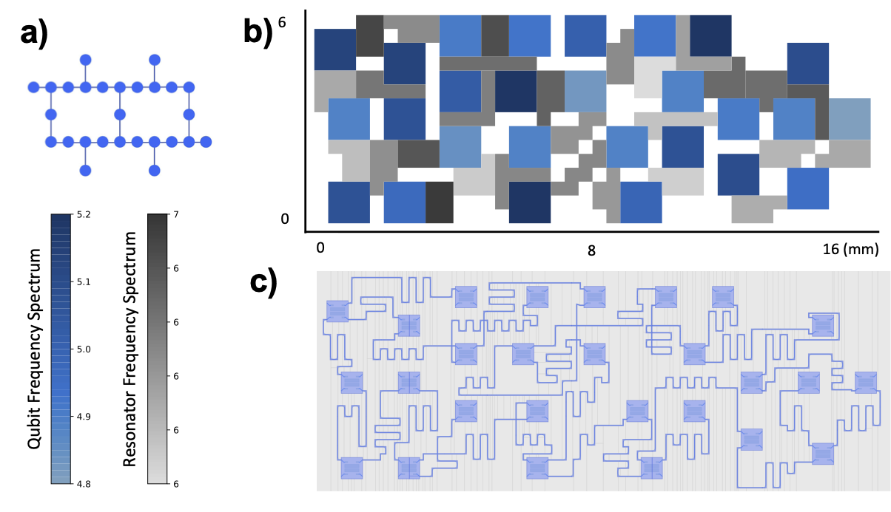

<h1><p align="center"> Qplacer: Deep learning toolkit-enable Superconducting Physical Qubit Placement </p></h2>


#### What it is doing
An efficient tool leveraging deep learning techniques to optimize nonlinear superconducting physical qubit layouts. Developed based on [Dreamplace](https://github.com/limbo018/DREAMPlace) with flexible deep learning toolkits, it runs on both CPUs and GPUs for versatile deployment.

#### Who will benefit
Researchers on quantum hardware device design, quantum device manufacture, and quantum design automation.

#### Reference Flow
<p align="center">
    
</p>

#### Sample Result
<p align="center">
    
    <!--  -->
    
</p>


## Publications

- Junyao Zhang, Hanrui Wang, Qi Ding, Jiaqi Gu, Reouven Assouly, William D Oliver, Song Han, Kenneth R Brown, Hai Li, Yiran Chen,
  "**Qplacer: Frequency-Aware Component Placement for Superconducting Quantum Computers**",
  arxiv, 2023
  ([preprint](https://arxiv.org/abs/2401.17450))


## Installation

This project is best built using a [Docker](https://hub.docker.com) container to streamline the process and manage all dependencies efficiently. [CMake](https://cmake.org) is adopted as the makefile system.

1. **Docker Installation:** Begin by installing Docker. Choose the appropriate version for your operating system:
   - [Windows](https://docs.docker.com/docker-for-windows/)
   - [Mac](https://docs.docker.com/docker-for-mac/)
   - [Linux](https://docs.docker.com/install/)

2. **Enabling GPU Features (Optional):** For GPU support, install [NVIDIA-docker](https://github.com/NVIDIA/nvidia-docker). This step can be skipped if GPU features are not needed.

3. **Clone the Repository:** The repository can be cloned in one of two ways:

   - **Full Recursive Clone:**
   This option clones the repository and all its submodules:

      ```bash
      git clone --recursive https://github.com/JJJayyyy/Qplacer.git
      cd Qplacer
      ```

   - **Selective Submodule Clone:** 
   This option only clones the necessary submodule of the project, which can save time and disk space:

      ```bash
      git clone https://github.com/JJJayyyy/Qplacer.git
      cd Qplacer

      git submodule init thirdparty/cub
      git submodule init thirdparty/pybind11
      git submodule init thirdparty/Limbo_qplacer_backup/limbo/thirdparty/OpenBLAS
      git submodule update
      ```

4. **Build the Docker Image:** Use the following command to build the Docker image, you can replace `jz420` with your name:

   ```bash
   docker build . --file Dockerfile --tag jz420/qplacer:cuda
   ```

5. **Launching the Container:** Depending on your setup (with or without GPU), use following command to start the Docker container and enter its bash environment.

   - **With GPU on Linux:**
     ```bash
     docker run --gpus 1 --name qplacer_container -it -v $(pwd):/Qplacer -w /Qplacer jz420/qplacer:cuda bash
     ```
        remove option `--gpus 1` to disable GPU.

6. **Setup Environment:** 
To set up the necessary environment and install the required packages:

   Activate the `qplacer_env` environment:
   ```bash
   conda activate qplacer_env
   ```

   Install all the dependencies listed in the `requirements.txt` file:
   ```bash
   pip install -r requirements.txt
   ```

7. **Build:** 
Navigate to the `qplacer` directory to start the build process. Execute the `compile.sh` script:
    ```
    ./compile.sh
    ```
    Where `build` is the directory where to compile the code, and `qplacer/operators` is the directory where to install operators.

    - **Conditional Build Option:** If all submodules have been cloned, there is a option to use the latest operators from `DreamPlace` by executing the following command:

        ```bash
        ./compile.sh OFF
        ```

    ***Warning:*** *Using the latest operators may lead to compatibility issues if there are changes that are not compatible with the current state of `Qplacer`*.

    `build` directory can be removed after installation if you do not need incremental compilation later. To clean, go to the root directory.

    ```
    rm -r build
    ```
    


## Get Benchmarks

To get quantum topology benchmarks, please refer the `qplacer/qplacer_example.ipynb`. The benchmark files and placement configuration files will be saved in directory `qplacer/benchmark` and `qplacer/test`, respectively


## Run Placer

Before running, make sure the **benchmarks** have been created and the python dependency packages/operators have been installed/built successfully.

Navigate to directory `qplacer` and run `qplacer_engine/Placer.py` with `json` configuration file for full placement.

```
python qplacer_engine/Placer.py test/grid-25/wp_wf/grid-25_wp_wf.json
```

## Contact
Junyao Zhang [Email](mailto:jz420@duke.edu), [Github issue](https://github.com/JJJayyyy/Qplacer/issues)


## Citation
```
@misc{zhang2024qplacer,
      title={Qplacer: Frequency-Aware Component Placement for Superconducting Quantum Computers}, 
      author={Junyao Zhang and Hanrui Wang and Qi Ding and Jiaqi Gu and Reouven Assouly and William D. Oliver and Song Han and Kenneth R. Brown and Hai "Helen" Li and Yiran Chen},
      year={2024},
      eprint={2401.17450},
      archivePrefix={arXiv},
      primaryClass={quant-ph}
}
```
